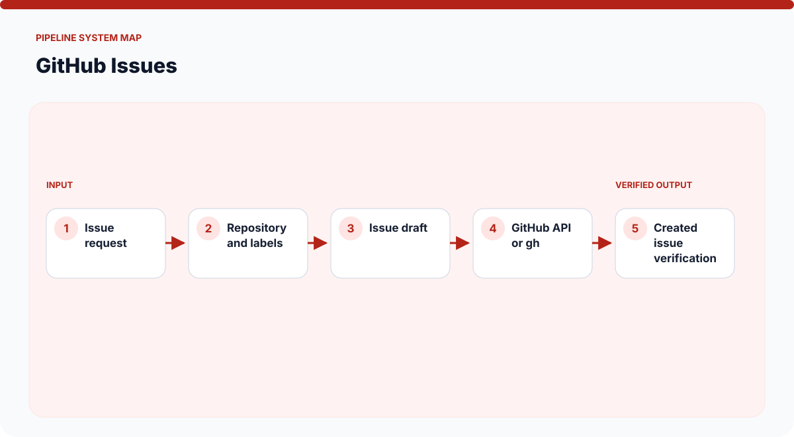
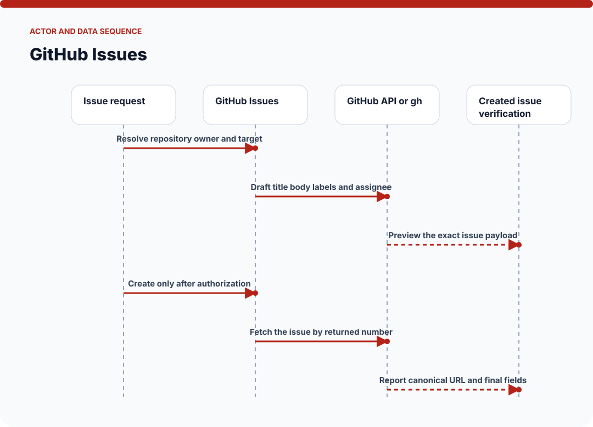
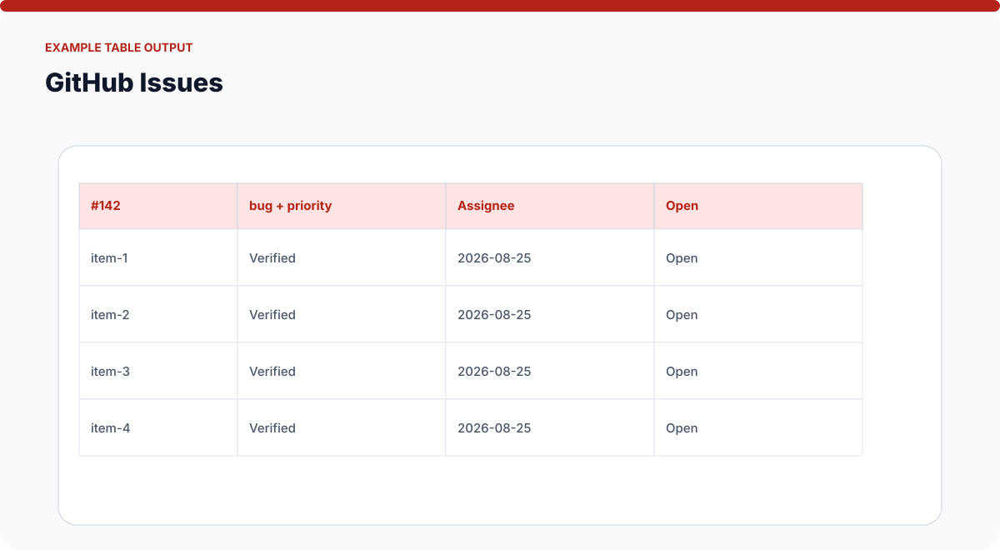
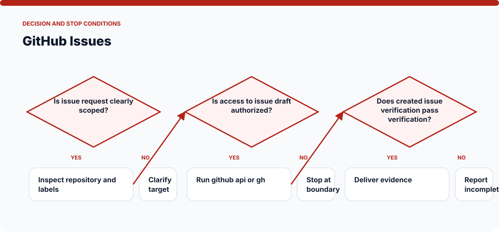

# How GitHub Issues Works

The visuals on this page are static SVGs, so they render directly on GitHub on phones and desktop browsers. Each one is generated from a model specific to this skill.

## System architecture

### Components

- **1. Issue request:** participates in resolve repository owner and target.
- **2. Repository and labels:** participates in draft title body labels and assignee.
- **3. Issue draft:** participates in preview the exact issue payload.
- **4. GitHub API or gh:** participates in create only after authorization.
- **5. Created issue verification:** participates in fetch the issue by returned number.

## Actor and data sequence

### 1. Resolve repository owner and target

**Primary surface:** `Issue request`

Record the concrete input, the operation performed, and the evidence produced at this stage. Continue only when the output is sufficient for the next stage; otherwise preserve the blocker and stop.
### 2. Draft title body labels and assignee

**Primary surface:** `Repository and labels`

Record the concrete input, the operation performed, and the evidence produced at this stage. Continue only when the output is sufficient for the next stage; otherwise preserve the blocker and stop.
### 3. Preview the exact issue payload

**Primary surface:** `Issue draft`

Record the concrete input, the operation performed, and the evidence produced at this stage. Continue only when the output is sufficient for the next stage; otherwise preserve the blocker and stop.
### 4. Create only after authorization

**Primary surface:** `GitHub API or gh`

Record the concrete input, the operation performed, and the evidence produced at this stage. Continue only when the output is sufficient for the next stage; otherwise preserve the blocker and stop.
### 5. Fetch the issue by returned number

**Primary surface:** `Created issue verification`

Record the concrete input, the operation performed, and the evidence produced at this stage. Continue only when the output is sufficient for the next stage; otherwise preserve the blocker and stop.
### 6. Report canonical URL and final fields

**Primary surface:** `Issue request`

Record the concrete input, the operation performed, and the evidence produced at this stage. Continue only when the output is sufficient for the next stage; otherwise preserve the blocker and stop.

## Example output shape

The example is a visual contract: a real run may look different, but it should expose comparable state, provenance, and verification information. It is not presented as evidence of a live external action.

## Decision and stop conditions

The workflow stops when the target is ambiguous, the relevant surface is unavailable or unauthorized, or the final artifact cannot be checked. A logged-in session or successful tool call is not by itself proof that the requested outcome is complete.

## Verification checklist

- Confirm every component shown in the system map exists in the target environment.
- Trace the actor sequence using actual tool output or artifact state.
- Compare the result with the example-output information contract.
- Re-read or reopen the final artifact instead of trusting an attempt message.
- Report omitted stages, unsupported capabilities, and remaining human decisions.
