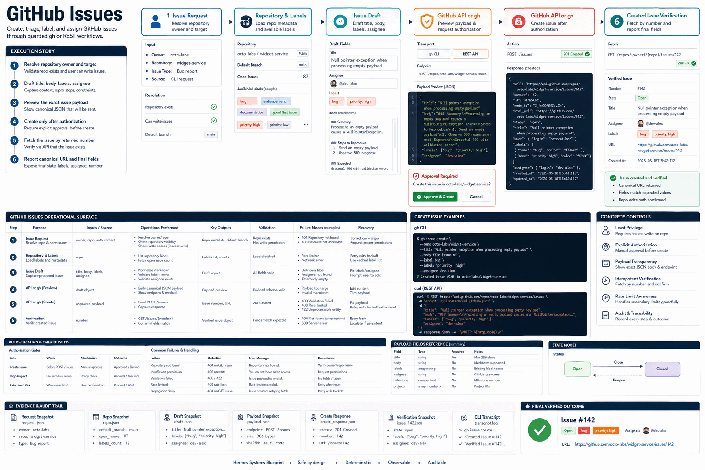

# How GitHub Issues Works

Create, triage, label, and assign GitHub issues through guarded gh or REST workflows.

## Stages

### 1. Resolve repository owner and target

**Primary surface:** `Issue request`

Record the input, operation, observable output, and any decision that changes scope. Stop here if the output is missing, contradictory, or insufficient for the next stage.
### 2. Draft title body labels and assignee

**Primary surface:** `Repository and labels`

Record the input, operation, observable output, and any decision that changes scope. Stop here if the output is missing, contradictory, or insufficient for the next stage.
### 3. Preview the exact issue payload

**Primary surface:** `Issue draft`

Record the input, operation, observable output, and any decision that changes scope. Stop here if the output is missing, contradictory, or insufficient for the next stage.
### 4. Create only after authorization

**Primary surface:** `GitHub API or gh`

Record the input, operation, observable output, and any decision that changes scope. Stop here if the output is missing, contradictory, or insufficient for the next stage.
### 5. Fetch the issue by returned number

**Primary surface:** `Created issue verification`

Record the input, operation, observable output, and any decision that changes scope. Stop here if the output is missing, contradictory, or insufficient for the next stage.
### 6. Report canonical URL and final fields

**Primary surface:** `Created issue verification`

Record the input, operation, observable output, and any decision that changes scope. Stop here if the output is missing, contradictory, or insufficient for the next stage.

## Failure handling

- **Authorization failure:** do not probe credentials or broaden access; report the missing authority.
- **Target ambiguity:** stop before mutation and request the minimum identifying information.
- **Tool or service failure:** retain error evidence, retry only safe transient failures, and cap retries.
- **Verification failure:** classify the run as incomplete even when the preceding operation returned success.

## Completion evidence

The handoff should contain the original request, inspection state, preview or plan, exact execution result, direct verification, and a final receipt naming limitations and withheld actions.
